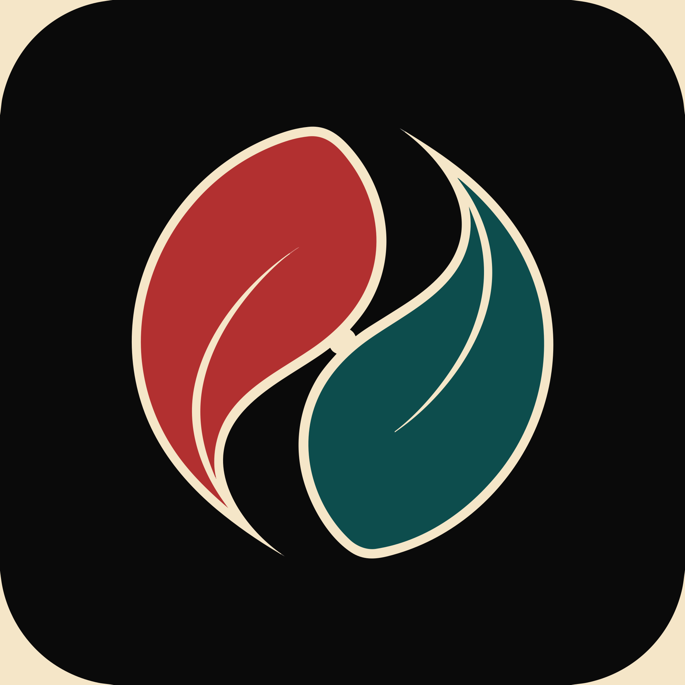
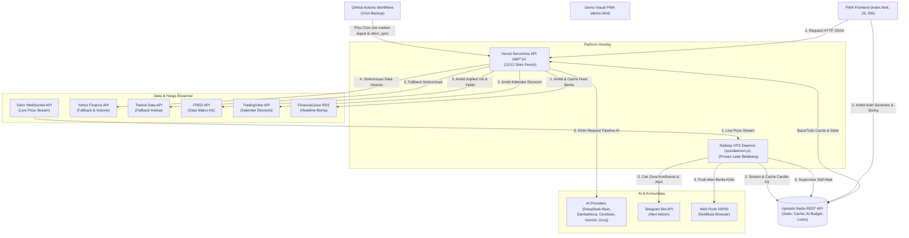

<p align="center">
  
</p>

# Daun Merah — Financial Feed PWA

Agregator berita finansial real-time yang dirancang khusus untuk trader forex/XAU Indonesia bergaya macro discretionary. Aplikasi ini menggabungkan data makroekonomi bank sentral, sentimen institusional (COT), indikator teknikal multitimeframe, serta analisis fundamental terstruktur yang ditenagai oleh kecerdasan buatan (AI) multi-provider.

Aplikasi ini menggunakan arsitektur Single-Page PWA pada frontend, Vercel Serverless Functions (Node.js CommonJS) sebagai backend API, Upstash Redis untuk caching dan state persistence, serta Railway VPS Daemon sebagai background processor real-time.

---

## Arsitektur Aliran Data & Sistem

Berikut adalah visualisasi interaksi real-time antara layanan internal, API eksternal, basis data, dan antarmuka pengguna:



---

## Fitur Utama

Aplikasi ini dibagi menjadi beberapa panel antarmuka yang terintegrasi:

1. **Live RSS Feed (feedScroll)**
   - Agregator berita finansial real-time dari FinancialJuice, InvestingLive, ING Think, dan rilis resmi bank sentral.
   - Cache proxy server-side selama 50 detik via Redis untuk performa maksimal dan efisiensi kuota.

2. **AI Market Digest (ringkasanPanel)**
   - Analisis pre-session Bahasa Indonesia: FX macro, fundamental emas (XAU/USD), bias sentimen, dan arah pergerakan pasar.
   - Dihasilkan otomatis 3 kali sehari (07:00, 14:00, 19:30 WIB) via Cron.
   - Menggunakan pipeline 3-call AI terstruktur untuk menghasilkan briefing prosa, tabel bias bank sentral, dan trade thesis terstruktur. Ditambah Call 4 personal alert jika device memiliki posisi terbuka.

3. **Analisa AI per Pair (analisaPanel)**
   - Mendukung 15 pasangan mata uang utama (EURUSD, GBPUSD, USDJPY, AUDUSD, USDCAD, USDCHF, NZDUSD, EURJPY, GBPJPY, EURGBP, AUDJPY, EURAUD, GBPAUD, GBPCAD, XAUUSD).
   - Menyediakan analisis teknikal & fundamental detail beserta level entry, Stop Loss (SL), dan Take Profit (TP) tertarget.
   - **Grounding Drivers Makro**: Menyuntikkan Broad Dollar (DXY) dan Crude Oil (WTI) serta breakdown Real Yield USD (nominal vs ekspektasi inflasi) langsung ke prompt AI untuk penalaran fundamental berbasis angka nyata.
   - Dilengkapi "Jendela Kesegaran 10 menit", "Gate Pasar Tutup" (menyajikan cache saat pasar libur), dan "Auto-Chain" (otomatis menganalisis pair aktif saat Ringkasan Berita di-refresh).

4. **CB Bias Tracker & Fundamental Ranking (fundamentalPanel)**
   - Pemantauan kebijakan suku bunga acuan dan sikap moneter (Hawkish/Dovish) dari 8 bank sentral utama (Fed, ECB, BoE, BoJ, RBA, RBNZ, BoC, SNB).
   - Perhitungan otomatis yield spread obligasi pemerintah serta penentuan kekuatan relatif mata uang (currency strength tertimbang waktu).

5. **Economic Calendar (calPanel)**
   - Kalender ekonomi dengan filter dampak tinggi (High-Impact) 7 hari ke depan berbasis data TradingView, dikonversi langsung ke Waktu Indonesia Barat (WIB).

6. **Commitment of Traders (COT) Report (cotPanel)**
   - Data positioning spekulan non-komersial institusional langsung dari CFTC untuk mengukur bias akumulasi/distribusi jangka panjang.

7. **Pre-Entry Check (checklistPanel)**
   - Lembar validasi sebelum melakukan eksekusi trading. Frontend akan men-tick secara deterministik berdasarkan data terkini (CB bias, COT, yield spread, level harga, kalender), kemudian memicu AI untuk memeriksa adanya kontradiksi logis atau faktor diskresioner lainnya.

8. **Risk Regime Indicator & Correlations**
   - Pengukur sentimen pasar global (Risk-On / Risk-Off) berdasarkan data korelasi aset lintas kelas (VIX, obligasi, komoditas, dan ekuitas global).
   - Perhitungan volatilitas tersirat CME CVOL untuk 6-pair utama yang di-batch dalam 1 request ke ScraperAPI untuk menghemat kuota proxy.

9. **Position Sizing Calculator (sizingPanel)**
   - Alat bantu kalkulasi ukuran lot transaksi berdasarkan persentase risiko, jarak SL, dan nilai pip pasangan mata uang.

10. **Trade Journal, Coach AI & Diagnosa Perilaku (jurnalPanel)**
    - Pencatatan aktivitas trading mandiri yang tersimpan di Redis. Dilengkapi dengan AI Coach yang menganalisis pola kemenangan/kekalahan untuk memberikan masukan perilaku berkala.
    - Diagnosa Perilaku Jurnal menganalisis tren psikologis seperti *disposition effect*, *overtrading*, serta distribusi sesi/playbook dari data trade yang sudah ditutup.

11. **Virtual Auto-Entry & Review Posisi (Developer-Only)**
    - Jalur eksperimental tertutup (`auto=1`) untuk XAU/USD (2 slot/hari) yang di-trigger oleh daemon. Evaluasi performa dicatat dalam log terpisah (`setup_log_auto:v1`) dengan simulasi transaction cost modeling (`cost_expectancy` % R-multiple net).
    - AI Reviewer secara dinamis meninjau posisi virtual yang terbuka berdasarkan berita makro geopolitik terbaru untuk memberikan rekomendasi HOLD/CLOSE/TIGHTEN_SL.

---

## Stack Teknologi

- **Frontend**: Vanilla HTML5, CSS3 (Custom design system), Vanilla JavaScript (PWA, Service Worker, Web Push API).
- **Backend API**: Vercel Serverless Functions (Node.js, CommonJS).
- **Daemon VPS**: Railway Daemon (Node.js, WebSocket client, event-driven processor).
- **Database/Cache**: Upstash Redis REST API (untuk mitigasi batas koneksi serverless).
- **Inference AI**: Official DeepSeek API, SambaNova Cloud, Cerebras Cloud, Google AI Studio (Gemini), Groq API.
- **Data Fetching**: Deriv WS, FRED API, TradingView Calendar, Yahoo Finance API, Twelve Data API.

---

## Struktur Direktori & Fungsi File

```
├── demo.html               # Halaman visual demo interaktif untuk presentasi UI
├── index.html              # Frontend utama: Struktur UI, PWA Logic, UI render
├── sw.js                   # Service Worker (Web Push, Offline Caching, Background Sync)
├── manifest.json           # Manifest PWA untuk instalasi mobile/desktop
├── newscat.js              # Source of Truth penggolongan berita makro (4 klasifikator)
├── package.json            # Dependensi utama proyek (web-push, test framework)
├── vercel.json             # Konfigurasi perutean, durasi timeout, & HTTP headers Vercel
├── api/                    # 12/12 Serverless Functions (SLOT PENUH)
│   ├── admin.js            # Consolidated endpoint (ohlcv, fundamental, health, checklist, dsb.)
│   ├── market-digest.js    # AI Digest pipeline: Briefing, CB Bias, Trade Thesis generator
│   ├── feeds.js            # Proxy RSS Feed dengan Redis Cache 50 detik
│   ├── calendar.js         # Fetch kalender ekonomi TradingView
│   ├── correlations.js     # Perhitungan korelasi cross-asset & Implied Volatility (CME CVOL)
│   ├── real-yields.js      # Perhitungan US vs Global Real Yield Differential
│   ├── rate-path.js        # Probabilitas suku bunga FedWatch (via ScraperAPI proxy)
│   ├── risk-regime.js      # Pengukur sentimen Risk-On/Risk-Off (VIX, Stooq data)
│   ├── journal.js          # CRUD Jurnal transaksi + evaluasi AI Coach Jurnal & Perilaku
│   ├── sizing-history.js   # Histori kalkulasi lot per-device
│   ├── subscribe.js        # Pendaftaran subscription token Web Push
│   ├── cb-status.js        # Data statis referensi awal Bank Sentral
│   ├── _ai_guard.js        # Pelindung budget AI (Daily Limit Guard via Redis)
│   ├── _app_key.js         # Validasi token komunikasi internal
│   ├── _circuit_breaker.js # Penangan fail-silent API eksternal
│   ├── _cron_dedup.js      # Pencegah dobel-generate digest antar-cron
│   ├── _fundamental_parser.js # Parser HTML/XML rilis data makroekonomi
│   ├── _market_hours.js    # Logika deteksi jam buka pasar forex
│   ├── _ohlcv_fetch.js     # Modul multi-source fetcher candle (Deriv, Yahoo, TwelveData)
│   ├── _ratelimit.js       # Pembatas laju request klien berbasis IP via Redis
│   └── _webpush.js         # Konfigurasi kunci VAPID dan pengiriman notifikasi
├── vps/                    # VPS Daemon Railway (Plan Q - Real-time processing)
│   ├── daemon.js           # Engine utama: WS Client Deriv, watchdog, scheduler, alerts
│   ├── heartbeat.js        # Backup beat processor (uptime indicator)
│   ├── newscat.js          # Salinan rules newscat untuk penggolongan berita di VPS
│   ├── package.json        # Dependensi daemon (node-cron, web-push)
│   ├── railway.json        # Konfigurasi auto-restart policy container di Railway
│   └── Dockerfile          # Spesifikasi container image Node.js 20+
├── scripts/                # Script offline & Backtesting
│   ├── backtest_confluence.js # Backtest area konfluensi lintas rezim volatilitas
│   ├── backtest_carry.js      # Backtest sinyal carry trade & yield differential
│   └── backfill_checklist_snapshot.js # Script backfill data checklist
├── test/                   # Suite Unit & Integrasi Test (npm test)
│   ├── admin/              # Unit test endpoint admin (makro context, cost modeling, dsb.)
│   ├── feeds/              # Unit test feeds
│   ├── frontend/           # Unit test integritas frontend
│   ├── journal/            # Unit test fitur jurnal
│   ├── market_digest/      # Unit test AI pipeline digest
│   ├── vps/                # Unit test untuk VPS daemon & self-healing
│   └── lib/                # Unit test utilitas internal
└── Dokumentasi/            # Folder Pusat Dokumentasi Proyek
    ├── daun_merah.md       # Changelog kronologis lengkap per sesi (SOT Konteks)
    ├── daun_merah_ai.md    # Detail pemakaian AI, model, limit, & fallback
    ├── daun_merah_vendor.md # Inventaris vendor infrastruktur & data
    ├── daun_merah_riset.md # Kumpulan hasil riset & pembelajaran terdistilasi
    ├── daun_merah_plan.md  # Plan handoff aktif antar-sesi
    └── daun_merah_progress.md # Parkir pekerjaan tertunda
```

---

## Rantai Fallback & Pipeline AI

Untuk memastikan uptime 100% menggunakan API gratisan, Daun Merah menerapkan sistem cascading fallback multi-provider yang diatur oleh `api/_ai_guard.js`.

### Rantai Fallback per Endpoint:

1. **Market Briefing (Digest Call 1 - Prosa)**
   `DeepSeek v4-flash (API Resmi)` &rarr; `SambaNova (DeepSeek-V3.2)` &rarr; `Cerebras (gpt-oss-120b)` &rarr; `Google AI Studio (Gemini Flash)` &rarr; `Groq (llama-3.3-70b)` &rarr; `Template Non-AI Deterministik (Fallback Absolut)`

2. **CB Bias & Thesis JSON (Digest Call 2 & 3)**
   `DeepSeek v4-flash (API Resmi)` &rarr; `SambaNova (DeepSeek-V3.2)` &rarr; `Google AI Studio (Gemini Flash - Native JSON)` &rarr; `Groq (llama-3.3-70b)`

3. **Analisa per Pair (ohlcv_analyze)**
   `DeepSeek v4-flash (API Resmi)` &rarr; `SambaNova Akun 1 (DeepSeek-V3.2)` &rarr; `SambaNova Akun 2 (DeepSeek-V3.2)` &rarr; *(Tanpa Groq/Gemini, jika gagal langsung return AI unavailable)*

4. **Analisa Fundamental & Coach Jurnal**
   `Cerebras (gpt-oss-120b)` &rarr; `SambaNova Akun 2 (DeepSeek-V3.2)` &rarr; `Groq (llama-3.3-70b)`

5. **Pre-Entry Check AI Verdict**
   `DeepSeek v4-flash (API Resmi)` &rarr; `SambaNova Akun 1 (DeepSeek-V3.2)` &rarr; *(Jika gagal, evaluasi deterministik client-side tetap berjalan)*

6. **Auto-Entry & Review Posisi (Eksperimen)**
   Mengikuti rantai fallback yang sama dengan *Analisa per Pair* untuk menjaga konsistensi data evaluasi.

### Budget Guard & Cooldown:
- **Jatah Harian (Redis Counter)**: DeepSeek (50/hari), SambaNova (200/hari per akun), Gemini (200/hari), Cerebras (200/hari), Groq (500/hari).
- **UI Cooldown**: Pembatasan 90 detik antar-generate disimpan di browser per peramban klien.
- **Server Single-Flight Lock**: Lock `lock:market_digest_generate` (TTL 55s) di Redis mencegah generate ganda ketika beberapa klien mengakses menu "Ringkas Ulang" secara bersamaan.

---

## Sistem Resiliensi, Self-Healing & Isolasi

Aplikasi ini dirancang dengan tingkat ketahanan tinggi melalui 5 lapisan proteksi:

- **Lapis 0 (Resiliensi Container)**: Penangkapan error `uncaughtException` di daemon memicu alert Telegram + `process.exit(1)`. File `vps/railway.json` memaksa Railway segera melakukan restart container segar.
- **Lapis 1 (Degradasi Redis)**: Kegagalan koneksi/rate limit Upstash Redis berturut-turut sebanyak >= 5 kali memicu Mode Degraded. Daemon akan mem-backoff penulisan data dan polling berita (cooldown melipat ganda hingga 30 menit).
- **Lapis 2 (WebSocket Watchdog)**: Daemon mengirim ping `{"ping":1}` ke Deriv WS tiap 60 detik. Jika tidak ada respons masuk > 180 detik, koneksi akan dibunuh paksa untuk memicu reconnect backoff bersih.
- **Lapis 3 (Resiliensi Sinkronisasi Data)**:
  - **Supervisor VPS**: Memeriksa umur candle sentinel EURUSD=X tiap 10 menit. Jika data basi > 3 jam saat pasar forex buka, daemon memicu `ohlcv_sync` otomatis.
  - **Vercel Kembar**: Endpoint `admin?action=health` mendeteksi data basi dan memicu `ohlcv_sync` mandiri via runtime serverless dengan pengunci Redis (`selfheal:ohlcv_sync`).
- **Lapis 4 (Penyelarasan & Dedup)**:
  - **Race Condition Lock**: Menghindari tubrukan tulis pada `setup_log` melalui `lock:setuplog_write:<key>` (TTL 10s).
  - **Cron Dedup**: Mencegah penulisan ganda dari pemicu bersamaan (GitHub Actions vs Railway Daemon) via penanda `ohlcv_sync:last_run_at` (TTL 45m).
  - **1H Fetch Dedup (Plan V-2b)**: Menghindari fetch ulang candle 1H jika data pada Redis `ohlcv:<symbol>:1h` terbukti fresh (< 75 menit), langsung memanfaatkan data stream dari daemon.
- **Lapis 5 (Isolasi Eksperimen)**: Memisahkan circuit breaker fitur publik dari fitur eksperimental developer-only (`isAutoCall`/`test_deepseek=1`) menggunakan breaker key terpisah (`ai:deepseek:experimental`, `ai:sambanova:main:experimental`, `ai:sambanova:c1:experimental`).

---

## Kunci Environment (Env Variables)

Daftarkan variabel berikut pada dashboard Vercel (untuk API) dan Railway (untuk Daemon):

### 1. Kredensial AI & Caching (Vercel & Railway)
```env
UPSTASH_REDIS_REST_URL=https://...-redis.upstash.io
UPSTASH_REDIS_REST_TOKEN=AX...
CRON_SECRET=super_secret_token_for_cron_auth
APP_KEY=app_access_security_key
```

### 2. Kunci API Penyedia AI (Vercel)
```env
DEEPSEEK_API_KEY=sk-ds-...          # Primary Engine (Berbayar resmi)
SAMBANOVA_API_KEY=sb-...            # SambaNova Akun 1 (Fallback & Analisa)
SAMBANOVA_API_KEY_CALL1=sb-...      # SambaNova Akun 2 (Fallback & Digest)
CEREBRAS_API_KEY=csk-...            # Cerebras Cloud (Fundamental & Coach)
GEMINI_API_KEY=AIzaSy...            # Google AI Studio (Fallback JSON)
GROQ_API_KEY=gsk_...                # Groq Cloud (Fallback Terakhir)
OLLAMA_API_KEY=ollama_...           # Ollama Cloud (Backup Diagnostic)
```

### 3. Kunci API Data & Proxy (Vercel & Railway)
```env
FRED_API_KEY=0a1b2c...              # Federal Reserve Economic Data
SCRAPER_API_KEY=scr_...             # ScraperAPI (Untuk tembus WAF CME Group)
TWELVEDATA_API_KEY=tw_...           # TwelveData API (Fallback OHLCV)
DERIV_APP_ID=1089                   # ID Aplikasi Deriv API (Publik/Dedicated)
```

### 4. Kredensial Notifikasi & Alerts (Vercel & Railway)
```env
TELEGRAM_BOT_TOKEN=123456:ABC-...
TELEGRAM_CHAT_ID=-100...
VAPID_PUBLIC_KEY=BI...
VAPID_PRIVATE_KEY=__...
VAPID_SUBJECT=mailto:sam@domain.com
```

---

## Pengembangan Lokal

### Prasyarat
- Node.js versi 20 atau lebih baru.
- Akun dan database Upstash Redis aktif.
- Vercel CLI terinstall secara global (`npm install -g vercel`).

### Langkah Instalasi
1. Clone repositori ke mesin lokal Anda:
   ```bash
   git clone https://github.com/sam01149/Daun_Merah_Terminal.git
   cd Daun_Merah_Terminal
   ```
2. Install dependensi untuk proyek utama dan folder daemon:
   ```bash
   npm install
   cd vps && npm install && cd ..
   ```
3. Salin file environment:
   ```bash
   cp .env.local.example .env.local
   # Kemudian edit nilai di dalam .env.local sesuai kredensial Anda
   ```
4. Jalankan server lokal menggunakan Vercel Dev:
   ```bash
   vercel dev
   ```
5. Untuk menjalankan VPS Daemon secara lokal:
   ```bash
   cd vps
   npm start
   ```

---

## Pengujian (Testing)

Aplikasi ini menggunakan modul test runner bawaan Node.js (`node --test`) yang sangat cepat dan bebas dependensi berat.

Jalankan seluruh suite pengujian menggunakan perintah:
```bash
npm test
```
*Catatan: Semua file pengujian berlokasi di dalam folder test/ dan diwajibkan 100% hijau sebelum perubahan di-push ke branch utama.*

---

## Aturan Rilis & Deployment (ATURAN.md)

Proyek ini dipandu oleh aturan ketat di dalam `ATURAN.md` sebagai Single Source of Truth (SOT) pengembangan:

- **Deploy Otomatis**: Deployment ke produksi dilakukan secara eksklusif via `git push origin main`. Penggunaan `vercel deploy --prod` diblokir.
- **Larangan Emoji**: Dilarang keras menampilkan emoji visual (seperti emoji pikiran, centang, tanda seru peringatan, tanda panah tebal) pada teks antarmuka UI aplikasi. Gunakan styling CSS modern atau ikon berbasis SVG.
- **Atribusi AI**: Dilarang menyertakan tanda `Co-Authored-By` AI atau penyebutan kontribusi agen AI dalam pesan commit. Satu-satunya kontributor terdaftar adalah `sam01149`.
- **Bumping Versi Kunci**: Setiap kali melakukan modifikasi pada file frontend `index.html` atau Service Worker `sw.js`, pastikan meningkatkan nomor versi string variabel `APP_VERSION` dan query cache parameter `?v=` secara serentak (lockstep).
- **Protokol Multi-Sesi**: Jika bekerja dalam mode paralel multi-sesi, klaim paket pekerjaan Anda terlebih dahulu pada file `daun_merah_plan.md` untuk menghindari tabrakan kode.
- **Unit Test Hijau**: Perubahan kode wajib lolos pengujian 100% sebelum dapat digabungkan ke branch utama.
